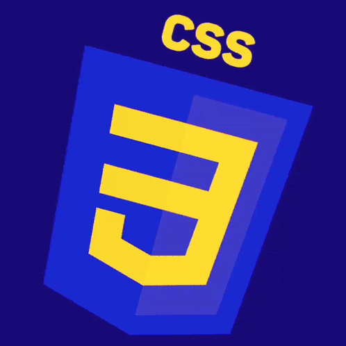

## css_advanced project  
- The project is basically focused on applying CSS rules to the HTML document📄 to look nice for a convinient user experience.👤  
- The media files required are located in the 'images' folder.
- Clone the repo and make it your own on your personal machine.  
 *Happy Coding*🚀🚀🚀